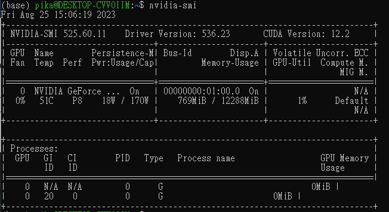
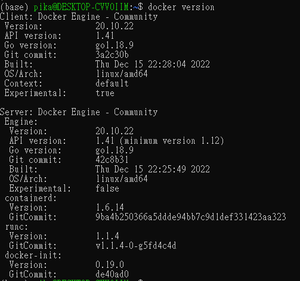
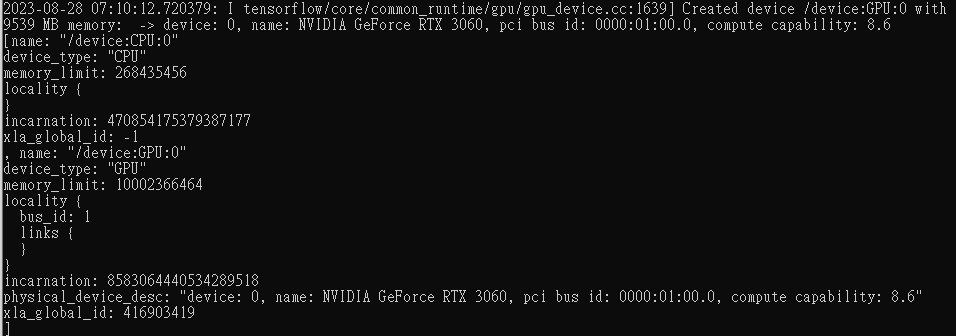
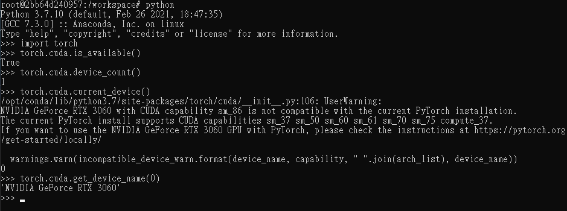

# Docker + GPU + WSL2

Build and run Docker container with NVIDIA GPUs on WSL2.

## Environment

- Windows10
- WSL2 (Ubuntu 22.04)
- NVIDIA GeForce RTX 3060
- Driver Version 536.23

## Method

### 1. Check NVIDIA Drive

After installation the NVIDIA Drive, you can check the Drive on terminal:

```bash
nvidia-smi
```



### 2. Install the Docker

- [Docker Desktop](https://docs.docker.com/desktop/install/windows-install/)

Check docker version on terminal

```bash
docker version
```



### 3. Install NVIDIA Container Toolkit on WSL2

Setting path

```bash
distribution=$(. /etc/os-release;echo $ID$VERSION_ID)

curl -s -L https://nvidia.github.io/nvidia-docker/gpgkey | sudo apt-key add -

curl -s -L https://nvidia.github.io/nvidia-docker/$distribution/nvidia-docker.list | sudo tee /etc/apt/sources.list.d/nvidia-docker.list
```

Install

```bash
sudo apt-get update

sudo apt-get install -y nvidia-docker2
```

### 4. Test docker

Restart Docker service

```bash
sudo service docker stop

sudo service docker start
```

Run a docker image with GPU banchmark

```bash
sudo docker run --rm --gpus all nvcr.io/nvidia/k8s/cuda-sample:nbody nbody -gpu -benchmark
```

### 5. Run with tensorflow with docker image

- tensorflow 2.13.0
- cuda 11.8
- cudnn 8.6

```bash
sudo docker run --gpus all -it tensorflow/tensorflow:latest-gpu bash
```

Into the bash of container and run python

```bash
python
```

Test Tensorflow

```python
from tensorflow.python.client import device_lib

device_lib.list_local_devices()
```



### 6. Run with Pytorch with docker image

- pytorch 1.9.0
- cuda 10.2
- cudnn 7

```bash
sudo docker run --gpus all -it pytorch/pytorch:1.9.0-cuda10.2-cudnn7-devel bash
```

Into the bash of container and run python

```bash
python
```

Test Pytorch

```python
import torch

torch.cuda.is_available()

torch.cuda.device_count()

torch.cuda.get_device_name(0)
```



## Reference

- [【windows11】GPU+tensorflow環境をwsl2+dockerで実現する。](https://qiita.com/daikon/items/72b8e0215250b31676c8)
- [用Docker執行pytorch/tensorflow，只要安裝nvidia driver即可](https://hackmd.io/@joshhu/Sy8MQetvS#%E7%94%A8Docker%E5%9F%B7%E8%A1%8Cpytorchtensorflow%EF%BC%8C%E5%8F%AA%E8%A6%81%E5%AE%89%E8%A3%9Dnvidia-driver%E5%8D%B3%E5%8F%AF)
- [安裝 Docker® 及 nvidia-docker2](https://www.ibm.com/docs/zh-tw/maximo-vi/continuous-delivery?topic=planning-installing-docker-nvidia-docker2)
