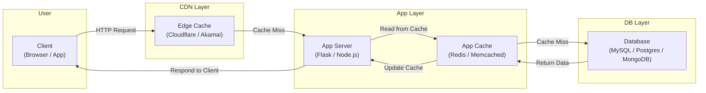
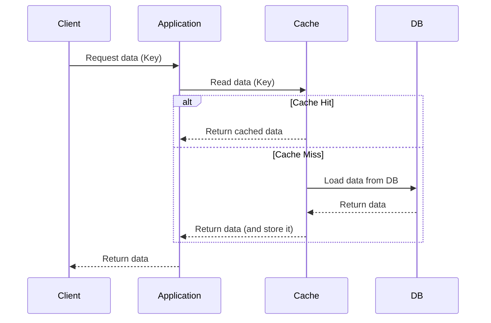
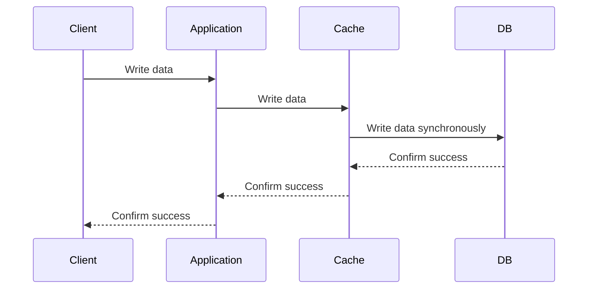
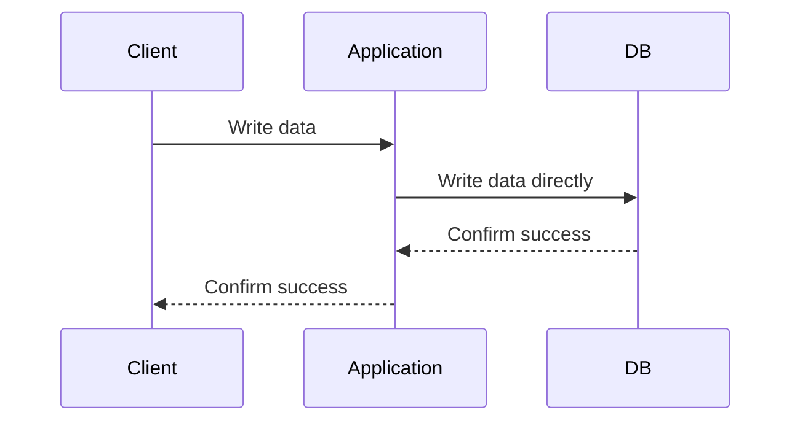
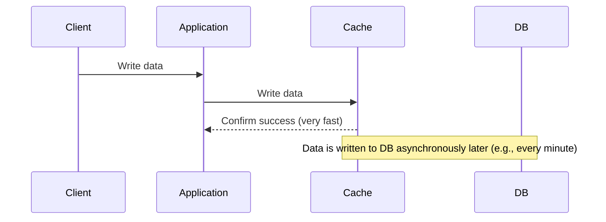
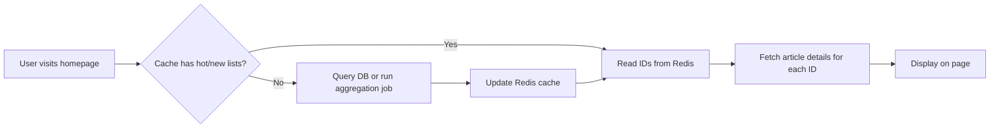

# Week 2: Cache Design and Strategies

## 1. Why Use Caching?
The primary goals of caching are to **reduce data access latency** and **decrease the load** on primary systems like databases.

## 2. Cache vs. Queue
It's crucial to understand the difference between a cache and a queue, as they solve different problems.

- **Cache**: Optimizes for fast data **reads** by storing frequently accessed data, avoiding repeated lookups from a slower source.
- **Queue**: Manages tasks by ensuring each task is **processed once**, decoupling services and enabling asynchronous workflows.

| Comparison         | 🧠 Cache                               | 📮 Queue                                        |
| ------------------ | ------------------------------------------ | --------------------------------------------------- |
| **Purpose**        | Store frequently used data to reduce latency & DB load. | Decouple services, queue tasks for asynchronous processing. |
| **Access Pattern** | Key-Value lookups for random reads.        | Primarily FIFO (First-In, First-Out) or event streams.  |
| **Consumer**       | Frontend clients, API servers (frequent lookups). | Worker services (process tasks sequentially).       |
| **Data Lifecycle** | Data is read multiple times until it expires or is evicted. | A task is typically processed once and then removed.  |
| **Example Use Case** | Caching user profiles, popular articles, query results. | Sending emails, video transcoding, processing orders. |
| **Keywords**       | `Redis`, `Memcached`, `LRU`, `TTL`           | `RabbitMQ`, `Kafka`, `Celery`, `Retry`, `Ack`         |
| **Data Loss Risk** | Data is transient and can be lost upon eviction or expiration. | Can be durable, but loss is possible if not configured correctly. |

### Quick Guide: Which One to Choose?

| Scenario                               | Recommended Tool |
| -------------------------------------- | ---------------- |
| Caching popular articles               | **Cache**        |
| Sending registration emails            | **Queue**        |
| Storing user's order history for display | **Cache**        |
| Background image format conversion   | **Queue**        |
| Processing a payment (must not be duplicated) | **Queue**        |
| Displaying a user's profile page       | **Cache**        |

## 3. Cache Tiers and Locations
Caching can be implemented at various layers of a system architecture.

| Tier               | Example                   | Pros                             | Cons                                      |
| ------------------ | ------------------------- | -------------------------------- | ----------------------------------------- |
| 📱 **Client-side** | Browser Cache, Service Worker | Near-zero latency for the user.  | Data can become stale, not shared across users. |
| 🌐 **CDN / Edge**  | Cloudflare, Akamai        | Close to users globally, fast.   | Best for static or semi-static content.     |
| 🚀 **Server-side** | Redis, Memcached          | Fast, flexible, shared across users. | Requires managing data consistency.         |
| 🗄️ **Database-side** | MySQL Query Cache         | Improves DB query performance.   | Cache must be invalidated on data updates.  |

## 4. Core Caching Strategies
These strategies define how data is read from and written to the cache.

| Strategy          | Read Flow                | Write Flow                  | Data Consistency | Cache Hit Rate | Common Use Case              |
| ----------------- | ------------------------ | --------------------------- | ---------------- | -------------- | ---------------------------- |
| **Read-Through**  | App → Cache → DB (on miss) | App → DB (cache is populated on next read) | Medium           | High           | Read-heavy workloads (articles) |
| **Write-Through** | App → Cache (always hits) | App → Cache & DB (synchronously) | High             | High           | Write-heavy, critical data (user settings) |
| **Write-Around**  | App → Cache → DB (on miss) | App → DB (bypasses cache)      | Low              | Low to Medium  | Infrequently read data (logs) |
| **Write-Back**    | App → Cache (always hits) | App → Cache (later writes to DB) | Eventual (risky) | High           | Write-intensive bursts (shopping carts) |

### 4.1. Read-Through Cache
The cache is responsible for reading data from the database on a cache miss.

- **Characteristics**: Simplifies application code, as the cache handles DB interaction. Ideal for read-heavy workloads.

### 4.2. Write-Through Cache
Data is written to the cache and the database simultaneously.

- **Characteristics**: Guarantees high consistency between cache and DB, but write latency is higher.

### 4.3. Write-Around Cache
Data is written directly to the database, bypassing the cache.

- **Characteristics**: Avoids flooding the cache with write-intensive data that may not be read soon. The cache is populated later via a read-through strategy.

### 4.4. Write-Back (Write-Behind) Cache
Data is written to the cache first and then written to the database in batches later.

- **Characteristics**: Fastest write performance, but carries a risk of data loss if the cache fails before data is persisted to the DB. Requires mechanisms like a Write-Ahead Log (WAL) for durability.

## 5. Cache Eviction Policies
When the cache is full, an eviction policy decides which items to discard.

| Policy                           | Description                               | Best For                                     |
| -------------------------------- | ----------------------------------------- | -------------------------------------------- |
| **LRU (Least Recently Used)**    | Discards the item that hasn't been used for the longest time. | General purpose, most common scenarios.    |
| **LFU (Least Frequently Used)**  | Discards the item that has been accessed the fewest times. | Caching data with clear "hot" access patterns. |
| **FIFO (First-In, First-Out)**   | Discards the oldest item, regardless of usage. | Simple scenarios, but often inefficient.     |
| **TTL (Time To Live)**           | Discards items that have expired.         | Ensuring data freshness and periodic updates. |

## 6. Practical Design Exercise

### Q1: Which cache strategy is best for these scenarios?

- **Order History System**: **Read-Through**. Order data is read frequently but updated less often. This reduces DB load while keeping data relatively fresh on read.
- **User Shopping Cart**: **Write-Back**. Carts change frequently and are temporary. Fast writes improve user experience. Data is only persisted to the DB upon checkout, but durability mechanisms (e.g., Redis AOF) are critical to prevent data loss.
- **Financial Transactions**: **Write-Through**. Consistency is paramount. Every transaction must be written to the cache and DB simultaneously to ensure data integrity, even at the cost of higher write latency.
- **User Activity Logs**: **Write-Around**. Logs are write-heavy but read infrequently. Writing directly to the DB avoids polluting the cache with data that is unlikely to be requested soon.

### Q2: How would you design a "hot articles" caching mechanism?

**Goal**: Design a caching strategy for a news website's homepage to efficiently display the "Top 10 Most Popular" and "Top 10 Newest" articles.

**Solution**:

1.  **Newest Articles**: `Write-Back + TTL Short`
    - **Strategy**: Use a Redis **List** (`LPUSH` on new article, `LTRIM` to keep size).
    - **Update**: When a new article is published, push its ID to the list.
    - **TTL**: Set a short TTL (e.g., 1-5 minutes) on the list key to ensure it stays fresh.

2.  **Most Popular Articles**: `Write-Through + LFU（Least Frequently Used`）
    - **Strategy**: Use a Redis **Sorted Set** (`ZINCRBY` to update scores).
    - **Hotness Score**: The score can be a combination of metrics.
        - `Score = (Views * 1) + (Likes * 3) + (Comments * 5)`
    - **Update**: Update scores in near real-time using event streams (e.g., Kafka) or periodic batch jobs (e.g., every 5 minutes).

3.  **Article Content**:
    - **Strategy**: Cache individual article content using a **Read-Through** pattern with a moderate TTL (e.g., 5-10 minutes).
    - **Key**: `article:{article_id}`

**Overall Flow**:

## 7. Further Learning
- Redis Cache Patterns
- ByteByteGo on YouTube: "Why and How to Cache"
- Practical Project: Implement an LRU cache with TTL in Python using Flask and Redis.

