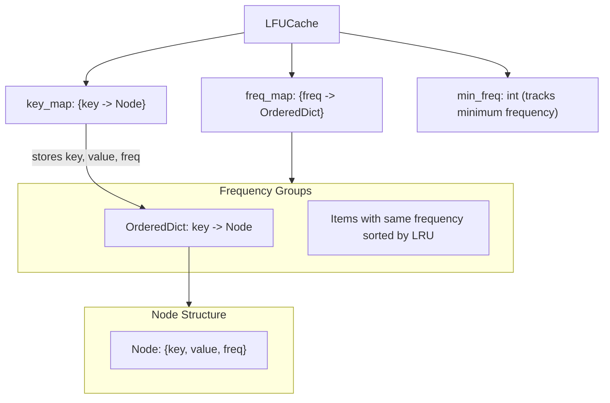
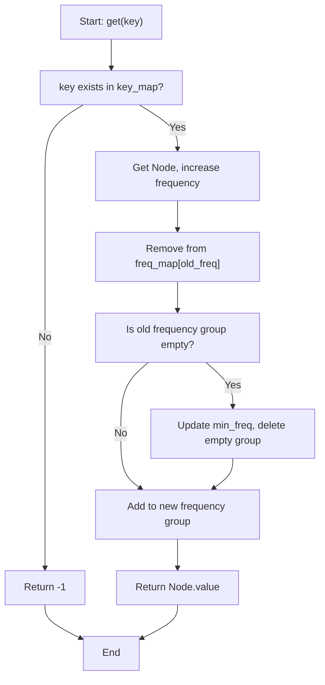
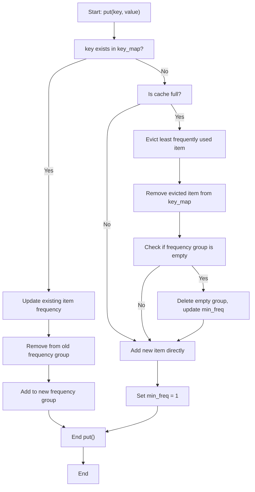

# LFU Cache (Least Frequently Used)

## Overview
LFU (Least Frequently Used) is a cache eviction strategy that prioritizes evicting items with the **lowest usage frequency** when cache space is insufficient. If multiple items have the same minimum frequency, LRU strategy is used to determine which one to evict.

## Core Concepts
- **Frequency Counting**: Each item has a frequency counter that records the number of times it has been accessed
- **Dual Eviction Strategy**: Evict by frequency first, then by most recent usage time when frequencies are equal
- **Time Complexity**: All operations are O(1)

## Data Structure Design



## Operation Flow

### Get Operation Flow


### Put Operation Flow


## Implementation Example

```python
from collections import OrderedDict

class LFUCache:
    def __init__(self, capacity: int):
        self.capacity = capacity
        self.key_map = {}  # key -> Node
        self.freq_map = {}  # freq -> OrderedDict
        self.min_freq = 0
    
    def get(self, key: int) -> int:
        if key not in self.key_map:
            return -1
        
        node = self.key_map[key]
        # 更新頻率
        self._update_frequency(node)
        return node.value
    
    def put(self, key: int, value: int) -> None:
        if key in self.key_map:
            # 更新現有項目
            node = self.key_map[key]
            node.value = value
            self._update_frequency(node)
        else:
            # 新增項目
            if len(self.key_map) >= self.capacity:
                self._evict_lfu()
            
            new_node = Node(key, value, 1)
            self.key_map[key] = new_node
            self._add_to_freq_map(new_node, 1)
            self.min_freq = 1
    
    def _update_frequency(self, node):
        """Update node frequency"""
        old_freq = node.freq
        node.freq += 1
        
        # Remove from old frequency group
        self.freq_map[old_freq].pop(node.key)
        if not self.freq_map[old_freq]:
            del self.freq_map[old_freq]
            if old_freq == self.min_freq:
                self.min_freq += 1
        
        # Add to new frequency group
        self._add_to_freq_map(node, node.freq)
    
    def _add_to_freq_map(self, node, freq):
        """Add node to frequency group"""
        if freq not in self.freq_map:
            self.freq_map[freq] = OrderedDict()
        self.freq_map[freq][node.key] = node
    
    def _evict_lfu(self):
        """Evict least frequently used item"""
        if not self.freq_map[self.min_freq]:
            return
        
        # Get least frequently used and least recently used item
        evict_key, _ = self.freq_map[self.min_freq].popitem(last=False)
        del self.key_map[evict_key]
        
        # If frequency group is empty, delete it
        if not self.freq_map[self.min_freq]:
            del self.freq_map[self.min_freq]

class Node:
    def __init__(self, key, value, freq):
        self.key = key
        self.value = value
        self.freq = freq
```

## Time Complexity Analysis
- **get()**: O(1) - Direct lookup from key_map
- **put()**: O(1) - All operations are constant time
- **Space Complexity**: O(capacity) - Stores at most capacity items

## Use Cases
- Scenarios where cache eviction should be based on usage frequency
- Some items are accessed repeatedly while others are rarely used
- Examples: Popular articles, frequently used features, frequently queried data


## Reference
- [460. LFU Cache](https://leetcode.com/problems/lfu-cache/)
- [Wiki - Least frequently used](https://en.wikipedia.org/wiki/Least_frequently_used)