# LRU Cache (Least Recently Used)

## Overview
LRU (Least Recently Used) is a cache eviction strategy that prioritizes evicting the **least recently used** items when cache space is insufficient. This is a time-based eviction strategy that assumes recently used items are more likely to be used again in the future.

## Core Concepts
- **Time Ordering**: Maintains the access time order of items
- **Doubly Linked List**: Uses doubly linked list for fast node movement
- **Fast Lookup**: Uses hash table for O(1) lookup
- **Time Complexity**: All operations are O(1)

## Data Structure Design

```mermaid
flowchart TD
    A[LRUCache] --> B[cache]
    A --> C[capacity]

    B["cache: OrderedDict(key -> value)"]
    C["capacity: int (cache capacity)"]

    subgraph linked_list["Internal Doubly Linked List (managed by OrderedDict)"]
        D["Nodes: key -> value"]
        E["MRU (Most Recently Used) ↔ LRU (Least Recently Used)"]
        F["Recently used on right, least recently used on left"]
    end

    B --> linked_list

    subgraph operations["Operation Description"]
        G["get(): Move to right end (MRU)"]
        H["put(): Add to right end, evict from left end (LRU)"]
    end

    linked_list --> operations
```



## Operation Flow

### Get Operation Flow


### Put Operation Flow


## Implementation Examples

### Method 1: Using OrderedDict (Recommended)
```python
from collections import OrderedDict

class LRUCache:
    def __init__(self, capacity: int):
        self.capacity = capacity
        self.cache = OrderedDict()
    
    def get(self, key: int) -> int:
        if key not in self.cache:
            return -1
        
        # Move to right end (most recently used)
        self.cache.move_to_end(key)
        return self.cache[key]
    
    def put(self, key: int, value: int) -> None:
        if key in self.cache:
            # Update existing item
            self.cache[key] = value
            self.cache.move_to_end(key)
        else:
            # Add new item
            if len(self.cache) >= self.capacity:
                # Evict least recently used item (left end)
                self.cache.popitem(last=False)
            
            self.cache[key] = value
```

### Method 2: Manual Doubly Linked List Implementation
```python
class Node:
    def __init__(self, key=0, value=0):
        self.key = key
        self.value = value
        self.prev = None
        self.next = None

class LRUCache:
    def __init__(self, capacity: int):
        self.capacity = capacity
        self.cache = {}  # key -> Node
        
        # Create dummy head and tail nodes
        self.head = Node()
        self.tail = Node()
        self.head.next = self.tail
        self.tail.prev = self.head
    
    def get(self, key: int) -> int:
        if key not in self.cache:
            return -1
        
        node = self.cache[key]
        # Move to head (most recently used)
        self._move_to_head(node)
        return node.value
    
    def put(self, key: int, value: int) -> None:
        if key in self.cache:
            # Update existing item
            node = self.cache[key]
            node.value = value
            self._move_to_head(node)
        else:
            # Add new item
            if len(self.cache) >= self.capacity:
                # Evict tail node (least recently used)
                tail = self._remove_tail()
                del self.cache[tail.key]
            
            new_node = Node(key, value)
            self.cache[key] = new_node
            self._add_to_head(new_node)
    
    def _add_to_head(self, node):
        """Add node to head"""
        node.prev = self.head
        node.next = self.head.next
        self.head.next.prev = node
        self.head.next = node
    
    def _remove_node(self, node):
        """Remove node"""
        node.prev.next = node.next
        node.next.prev = node.prev
    
    def _move_to_head(self, node):
        """Move node to head"""
        self._remove_node(node)
        self._add_to_head(node)
    
    def _remove_tail(self):
        """Remove tail node and return it"""
        last_node = self.tail.prev
        self._remove_node(last_node)
        return last_node
```

## Time Complexity Analysis
- **get()**: O(1) - Hash table lookup + linked list movement
- **put()**: O(1) - Hash table operations + linked list operations
- **Space Complexity**: O(capacity) - Stores at most capacity items

## Use Cases
- Scenarios where cache eviction should be based on recent usage time
- Assumes recently used items are more likely to be used again in the future
- Examples: Browser cache, CPU cache, database query cache

## LRU vs LFU Comparison

| Feature | LRU | LFU |
|---------|-----|-----|
| **Eviction Criteria** | Most recent usage time | Usage frequency |
| **Best For** | Strong temporal locality | Strong frequency locality |
| **Implementation Complexity** | Simple | More complex |
| **Memory Overhead** | Lower | Higher (needs frequency tracking) |
| **Typical Applications** | Browser cache, CPU cache | Popular articles, recommendation systems |

## Reference
- [146. LRU Cache](https://leetcode.com/problems/lru-cache/description/)
- [Wiki - Least Recently Used](https://en.wikipedia.org/wiki/Cache_replacement_policies#LRU)