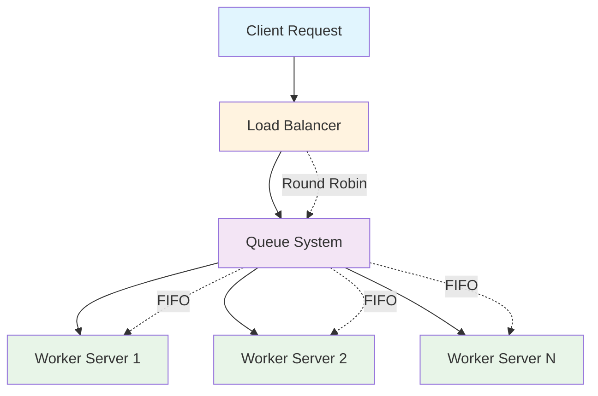
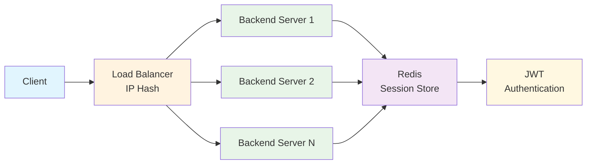
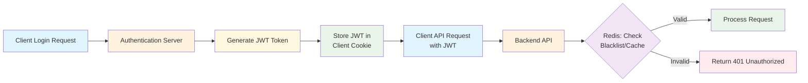
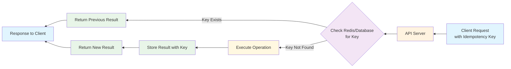

# Week 1: Scalability & Load Balancing

## Overview
This document covers fundamental concepts of system scalability and load balancing strategies for handling high-traffic applications.

## Core Concepts

### Scalability
The ability of a system to handle increased load while maintaining performance and reliability.

| Type | Description | Pros | Cons |
| :--- | :--- | :--- | :--- |
| **Vertical Scaling (Scale Up)** | Increase resources (CPU, RAM, Disk) on a single server. | Simple, fast, no architectural changes required. | High cost, hardware limitations, single point of failure. |
| **Horizontal Scaling (Scale Out)** | Add more servers to distribute traffic. | Virtually unlimited scaling, more resilient. | More complex architecture, requires load balancing and state synchronization. |
| **Auto Scaling** | Automatically adds or removes servers based on traffic load. | Cost-effective (pay for what you use), elastic to handle traffic spikes, improved fault tolerance. | Complex configuration, potential "cold start" delays for new instances, risk of misconfigured policies. |

### Load Balancer
A component that distributes incoming network traffic across multiple servers to ensure no single server bears too much load.

#### Common Strategies
| Strategy | Description | Use Case |
| :--- | :--- | :--- |
| **Round Robin** | Sequentially distributes requests to the next server. | Simple, even distribution for stateless servers. |
| **IP Hash** | Assigns requests to a specific server based on client IP. | Services requiring session persistence (sticky sessions). |
| **Least Connection** | Sends requests to the server with the fewest active connections. | Ensures the most even dynamic load distribution. |
| **Latency-based** | Routes traffic to the server with the lowest latency for the client. | High-frequency reads, global services (e.g., CDNs). |

## Practice Exercise: API Design

### Scenario
Design a load distribution architecture for an API handling 1 million requests per day.

### Questions to Consider:
1. **Scaling Strategy**: Would you choose Vertical or Horizontal scaling?
2. **Load Balancer Strategy**: What load balancing algorithm would you use?
3. **Session Management**: How would you handle session state (e.g., login information)?

### Recommended Solution

#### 1. Scaling Approach
**Primary Strategy**: Start with Vertical scaling for cost efficiency, then implement Dynamic Horizontal scaling for peak traffic.

**Reasoning:**
- Vertical scaling is simpler and more cost-effective initially
- Horizontal scaling provides better fault tolerance and unlimited growth potential
- Dynamic scaling handles traffic spikes efficiently

#### 2. Load Balancer Strategy
**For Simple APIs**: Use Round Robin with Queue system
**For Session-aware Applications**: Use IP Hash for sticky sessions

**Round Robin + Queue Architecture:**

#### 3. Session Management
**Solution**: IP Hash Load Balancer + Redis + JWT

**Architecture:**

## Advanced Considerations

### When to Use Horizontal Scaling
- CPU usage consistently > 80%
- Vertical scaling becomes cost-prohibitive
- High single-point-of-failure risk
- Traffic growth exceeds vertical scaling capacity

### Queue System Risks & Solutions

#### 1. Queue Backpressure
**Problem**: Queue becomes overwhelmed with requests
**Solutions**:
- Auto-scale worker processes
- Increase queue storage capacity
- Implement backpressure mechanisms

#### 2. Message Loss/Duplication
**Problem**: Messages may be lost or processed multiple times
**Solution**: Implement Idempotency Keys

#### 3. Queue Availability
**Problem**: Single queue becomes a bottleneck
**Solutions**:
- Redis Sentinel for high availability
- Redis Cluster for distributed queues
- Backup queue systems

### Advanced Session Management

#### Sticky Sessions
**Types**:
- **IP Hash**: Route based on client IP
- **Cookie Sticky**: Route based on session cookies
- **Session Store**: Centralized session storage

**Best Practice**: Use Redis + JWT instead of local memory storage

#### JWT + Redis Architecture

### Traffic Spike Protection

#### 1. Rate Limiting
- **Token Bucket**: Allow burst traffic up to a limit
- **Leaky Bucket**: Smooth out traffic spikes
- **Fixed Window**: Simple time-based limiting

#### 2. CDN/Edge Caching
- Cache static content at edge locations
- Reduce origin server load
- Improve global response times

#### 3. Circuit Breaker Pattern
- Prevent cascade failures
- Fail fast when dependencies are down
- Automatic recovery mechanisms

## Idempotency Implementation

### What is Idempotency?
An operation that produces the same result regardless of how many times it's executed.

### Idempotency Key Flow

### Key Generation Strategies
1. **Client-generated**: Client creates UUID for each request
2. **Server-generated**: Server creates key based on request content
3. **Hybrid**: Client provides key, server validates and stores

### Best Practices
- Use UUID v4 for key generation
- Set appropriate TTL (Time To Live) for keys
- Handle key collisions gracefully
- Monitor key storage usage

## Kubernetes Considerations

### Scaling in Kubernetes
- **Horizontal Pod Autoscaler (HPA)**: Scale based on CPU/memory metrics
- **Vertical Pod Autoscaler (VPA)**: Adjust resource requests/limits
- **Cluster Autoscaler**: Scale node pools based on demand

### Load Balancing in Kubernetes
- **Service Load Balancer**: Built-in load balancing
- **Ingress Controllers**: Advanced routing and load balancing
- **External Load Balancers**: Cloud provider load balancers

### Monitoring Metrics
- **CPU Usage**: Primary scaling metric
- **Memory Usage**: Secondary scaling metric
- **Request Rate**: Traffic-based scaling
- **Response Time**: Performance-based scaling
- **Error Rate**: Reliability-based scaling

## Summary

For handling 1 million daily requests:
1. **Start with Vertical scaling** for cost efficiency
2. **Implement Horizontal scaling** for growth and reliability
3. **Use Round Robin** for simple APIs, **IP Hash** for session-aware apps
4. **Implement Redis + JWT** for session management
5. **Add Rate Limiting and CDN** for traffic spike protection
6. **Use Idempotency Keys** for reliable message processing
7. **Monitor and auto-scale** based on key metrics
